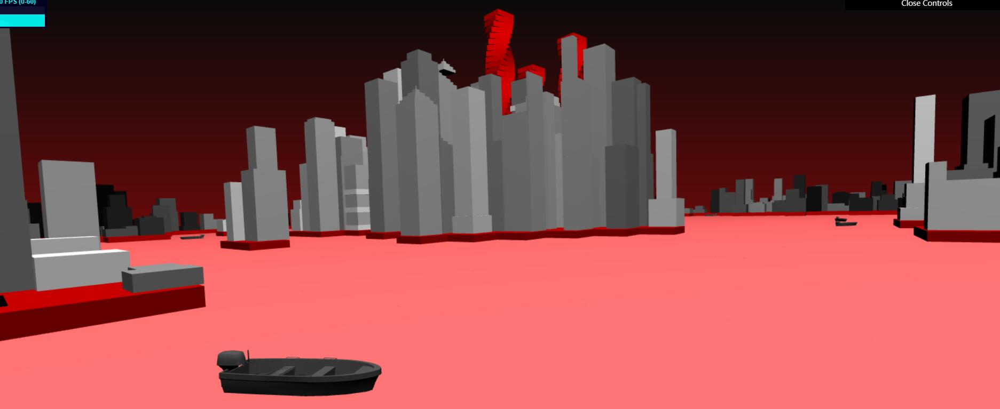

# Project 5: Shape Grammar

Author: Yuru Wang

Finish Time: 3/1/2018

Terrain:

The terrain pattern is generated using a simple noise-based algorithm:

First divide the terrain into 40 by 40 grid, and use a two dimensional array to store the block type on each grid.

Start from 4 seed points in the terrain, mark them as sea block, for each seed, start marching from an arbitary direction and mark the block it reaches as sea block, and stops once it go beyond terrain boundary.

Repeat the same operation above to mark central island blocks where building arises on the map.   

Call corresponding functions for sea block and building block to build the city.

Garmmer rules:

totally 5 different grammers, each of which with a probability of 0.2

rule 1: subdivide geometry along x axis into 3 parts with different scale. Parent shapes whose geometry volume is below certain threshold are not eligible for this rule. The scale of each parts are determined using simple random function. New generated shapes' terminal attribute are false(they can be passed to next iteration of grammer expansion)

rule 2 : divide geometry along Y axis into two new cubes, upper one with smaller scale. Again the scale is calculate using random number between 0.5 to 1. New generated shapes' terminal attribute are false(they can be passed to next iteration of grammer expansion)

rule 3 : subdivide geometry along Y axis and rotate each components to form spiral shape. new generated shapes are invalid to be passed to next round of iteration. This rule is only available for parent shapes whose position are within a small radius range from terrain center

rule 4 : add pyramid-shape roof on top of current shape. The roof scale is dependent on parent symbol's scale. New generated shapes are invalid to be passed to next round of iteration. This rule is only available for parent shapes whose position are within a medium radius range from terrain center

rule 5: add rings to the geometry along y axis. The number of rings is dependent on parent symbol's height. New generated shapes are invalid to be passed to next round of iteration. This rule is only available for parent shapes whose position are within a large radius range from terrain center

Coloration:

The coloration of building is based on building's position on the terrain. Buildings are colored using gray scale values whose overall intensity are based on the distance between its position and terrain center. In addition, there are some offsets on the grayscale's intensity based on noise. For buildings with large height, they are colored using red

Screenshots:

